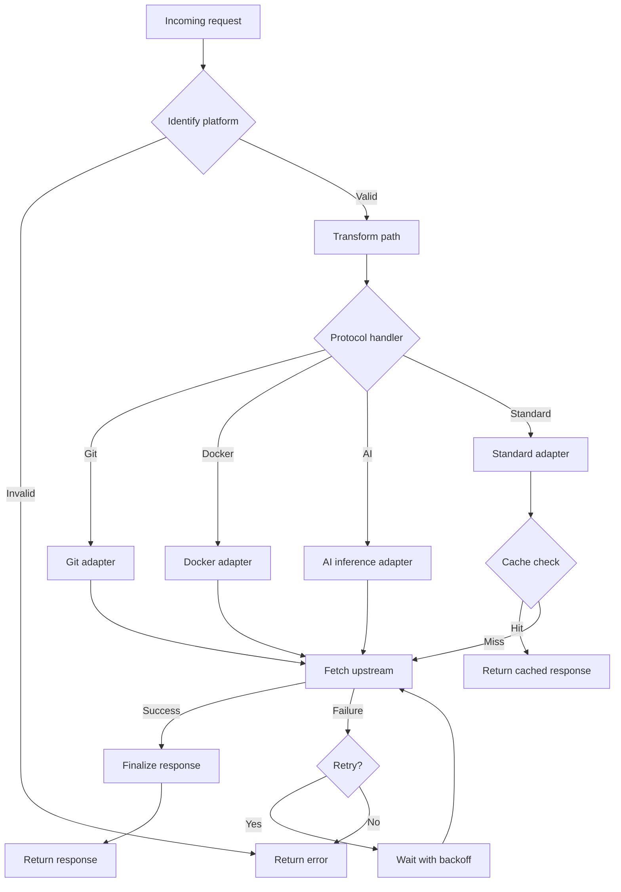

Xget is an ultra-high-performance, secure acceleration engine for developer resources. It proxies requests to code hosts, package registries, container registries, AI inference providers, and Linux distribution mirrors through Cloudflare's global edge network — bringing upstream services closer to you and improving speed and reliability without changing your workflow. Whether you're cloning a GitHub repository, pulling a container image, or calling the OpenAI API, Xget handles caching, retries, security headers, and protocol-specific behavior transparently.

## Key features

<CardGroup cols={2}>
  <Card title="Global edge network" icon="globe">
    Built on Cloudflare Workers and deployed at edge locations worldwide, Xget runs close to both users and upstream services to minimize latency.
  </Card>
  <Card title="40+ platforms supported" icon="layer-group">
    Unified acceleration for code repositories, package managers, container registries, AI inference providers, Linux distributions, and more — all under one URL scheme.
  </Card>
  <Card title="Full Git protocol support" icon="code-branch">
    Transparently handles Git clone, push, pull, and LFS traffic. Automatically detects Git-specific endpoints and preserves authentication headers.
  </Card>
  <Card title="Enterprise security headers" icon="shield-halved">
    Every response includes HSTS, CSP, X-Frame-Options, Referrer-Policy, Permissions-Policy, and X-XSS-Protection headers applied automatically.
  </Card>
  <Card title="Edge caching and intelligent retry" icon="bolt">
    Responses are cached at the edge for 30 minutes by default. Transient upstream failures trigger up to 3 automatic retries with linear backoff.
  </Card>
  <Card title="Performance monitoring" icon="chart-line">
    A built-in `PerformanceMonitor` tracks request stage durations and exposes timing data via `X-Performance-Metrics` response headers.
  </Card>
</CardGroup>

## How requests flow through Xget

When a request reaches Xget, it passes through a pipeline of stages before returning a response:

1. **Identify platform** — the path prefix (e.g., `gh`, `npm`, `cr/docker`) is matched against the platform catalog. Invalid or missing prefixes return an error immediately.
2. **Transform path** — the prefix is stripped and the remaining path is normalized into the upstream URL format for the target platform.
3. **Protocol handler** — the request is routed to the appropriate adapter: Git, Docker registry, AI inference, or standard HTTP.
4. **Cache check** — for standard GET and HEAD requests without sensitive headers, Xget checks the edge cache before going upstream.
5. **Upstream fetch** — on a cache miss, Xget fetches from the upstream origin with timeout enforcement (30 seconds by default) and retry logic.
6. **Response finalization** — security headers are applied, the response is stored in cache if eligible, and performance metrics are attached.



## Supported platforms

Xget uses a short prefix in the URL path to identify the target platform. The full conversion format is:

```
https://{instance}/{prefix}/{original-path}
```

| Category | Platforms |
| --- | --- |
| Code repositories | GitHub, GitHub Gist, GitLab, Gitea, Codeberg, SourceForge, AOSP |
| AI model hubs | Hugging Face, Civitai |
| Package managers | npm, PyPI, conda, Maven, Apache, Gradle, Homebrew, RubyGems, CRAN, CPAN, CTAN, Go modules, NuGet, Rust Crates, Packagist, Flathub |
| Linux distributions | Debian, Ubuntu, Fedora, Rocky Linux, openSUSE, Arch Linux |
| Other resources | arXiv, F-Droid, Jenkins plugins |
| Container registries | Docker Hub, Quay.io, GCR, MCR, ECR, GHCR, GitLab, Red Hat, Oracle, Cloudsmith, DigitalOcean, VMware, Kubernetes, Heroku, SUSE, openSUSE, Gitpod |
| AI inference providers | OpenAI, Anthropic, Gemini, Vertex AI, Cohere, Mistral AI, xAI, GitHub Models, NVIDIA API, Perplexity, Groq, Cerebras, SambaNova, HF Inference, Together, Replicate, Fireworks, OpenRouter, and more |

See the [URL conversion reference](/url-conversion) for the complete prefix table and conversion examples.

## Get started

<CardGroup cols={2}>
  <Card title="Quickstart" icon="rocket" href="/quickstart">
    Make your first accelerated request and configure your tools in minutes.
  </Card>
  <Card title="URL conversion" icon="link" href="/url-conversion">
    Full reference table of all platform prefixes and conversion examples.
  </Card>
</CardGroup>
